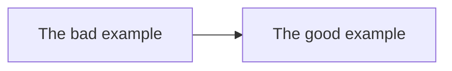

# A11y and HTML: The good and the bad way

There will be 2 examples of HTML code: the good and the bad one. The goal is to show how to make HTML code more accessible

## Table of Contents

- [The bad example](#the-bad-example)
  - [What's wrong with it?](#whats-wrong-with-it)
- [The good example](#the-good-example)

## The bad example

[… go to the bad example](bad_example/bad_example.html)!

### What's wrong with it?

- meta tags missing
- no lang attribute
- no title tag
- more than one h1
- too little semantic markup
- no proper heading hierarchy
- no proper form controls
- no proper image markup
- no proper link markup
- no proper list markup
- inline CSS styles
- email as a link instead of mailto

## The good example

[… got to the good example](good_example/good_example.html)!

### What's good about it?

- all necessary meta tags present
- lang attribute present
- title tag present
- only one h1
- semantic structure and markup
- heading hierarchy
- proper form controls
- proper image markup
- proper link markup
- proper list markup
- no inline CSS styles
- email as a mailto link
