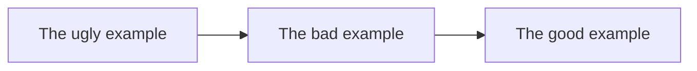

# A11y and HTML: The good, the bad, and the ugly

There will be 3 examples of HTML code: the good, the bad, and the ugly. The goal is to show how to make HTML code more and more accessible.

### Table of Contents

- [The ugly example](#the-ugly-example)
- [The bad example](#the-bad-example)
- [The good example](#the-good-example)

## The ugly example

[… got to the ugly example](ugly_example/ugly_example.html)!

- meta tags missing
- no lang attribute
- no title
- more than one h1
- too little semantic markup
- no proper heading hierarchy
- no proper form controls
- no proper image markup
- no proper link markup
- no proper list markup
- inline CSS styles
- email as a link instead of mailto

## The bad example

[… got to the bad example](bad_example/bad_example.html)!

- meta tags
- no lang attribute

## The good example

[… got to the good example](good_example/good_example.html)!
